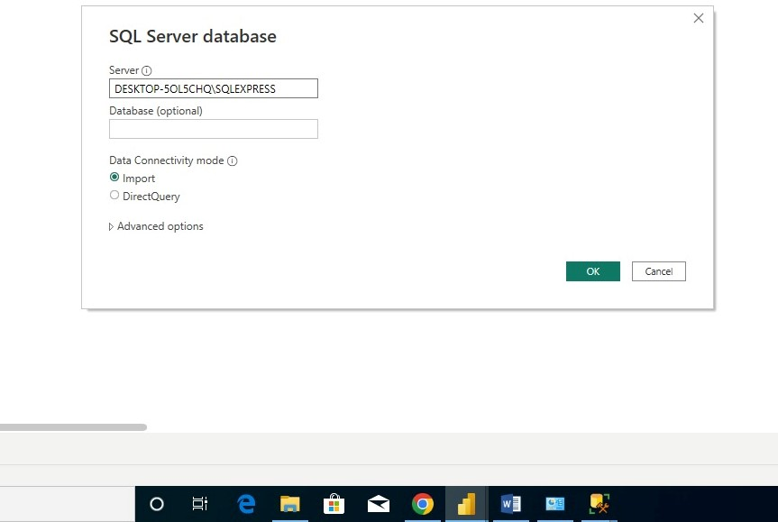
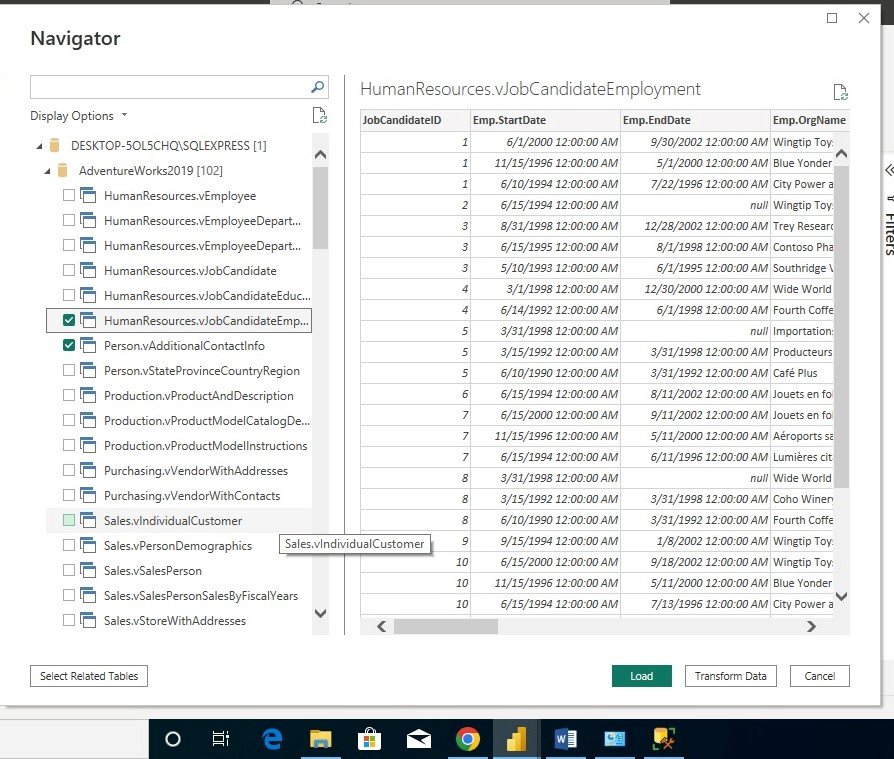
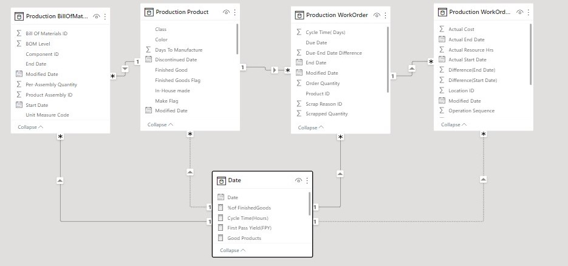
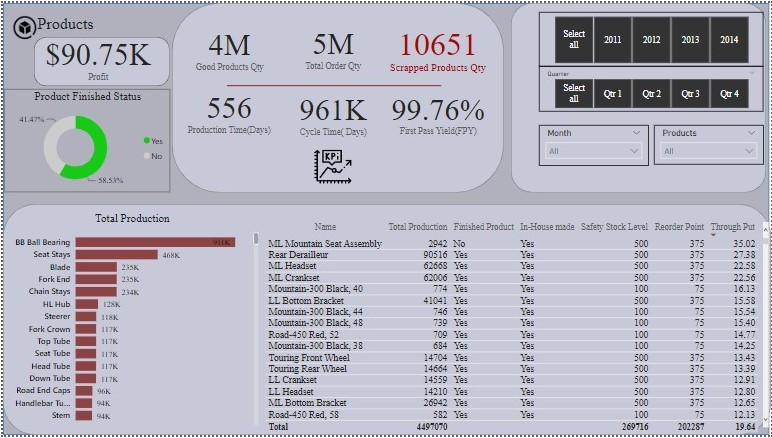
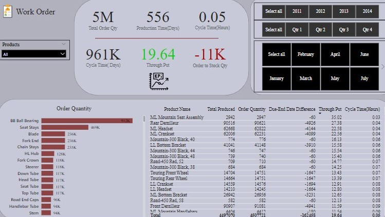
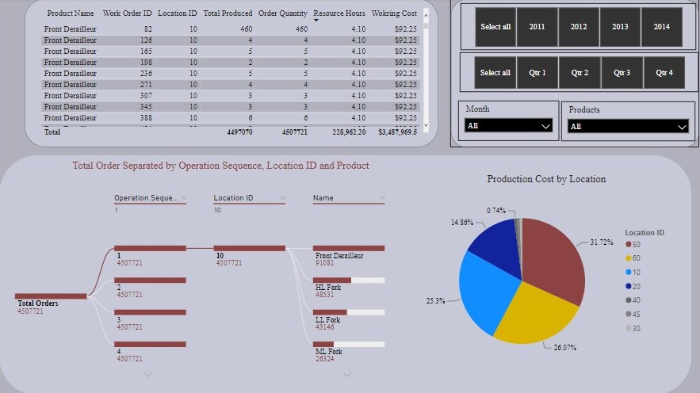
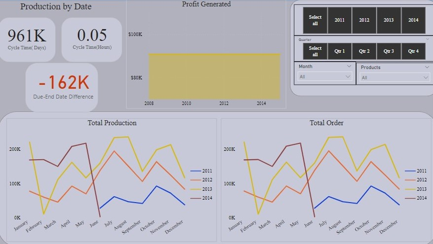

# AdventureWorks 2019 Production Analysis

_ _ _

## Introduction
This project was carried out on Power BI, the aim being to give insight to the producers about their production performance by the products, work order, work order routing and by date.

## Problem Statement
- Create a **Products** dashboard to show production performnce by products,
- Create a **Work Order** dashboard to show production by work order and measure performance,
- Create a **Work Order Routing** dashboard to show routing details and production performance,
- Create a dashboard to show production by date and trend
  
  ## Skills Used
  - Slicers,
  - Measures(Using DAX),
  - Model Relationship,
  - Data cleaning and transformation

    ## Data Sourcing
    The data used was gotten from the AdventureWorks database by connecting my Power BI Desktop to an SQL server(my local machine in this instance). only four tables were used, all under production
    
    
  - - -
    ## Data Transformation
    Using the power query editor, the data was cleaned.
    - Column headers were renamed using appropriate cases,
    - Data types of some columns were adjusted
    - 
    Within the Power BI itelf, that is after leaving the power query editor, the following were done.
- A date table was created using the 'CALENDARAUTO()' function,
To guage production performance, KPIs were calculated , by creating measures and calculated columns.
- **First Pass Yield** was calculated with a measure by dividing total good products by total quantity produced,
-  **Throughput** was calculated with a measure by dividing total quantity produced by total resource hours invested,
- **Profit** was gottten by subtracting cost price from selling price,
- **Cycle Time** was calculated with a measure by dividing total resource hours by total quantity produced

## Modelling
The tables formed a snowflake schema, as fact table was connected to dimensions table and there was also dimension to dimension table relationship.

## Visualizations and Analysis
The report was spread across four tables, all showing production but by different metrics.
The first showed production by products

We can get the following from above
1. The total quantity produced ia approximately **4.5 million**
2. The overall First pass yield at **99.76%** shows that the production process is effective and wasted products are at a minimal.
3. Approximately **59%** of their product had finished production process, while about **41%** haven't.
4. The Throughput of the company at approximately **20** shows that the company makes about 20 products per hour. this is becaus production time was measured in hours.
5. Overall, **BB Ball Bearing** was the most produced item.
- - -
The second paage shows production by workorder

From above, we can see the following
1. The total quantity ordered is approximately **5 million** 
2. The **Order to Stock quantity** value at **-11k** meaning **-11 Thousand** shows that total quantity produced is less than total quantity ordered by 11 thousand products.
3. The **due-to-end date** column shows the amount of days between when a product was due and when the product was actually delivered. The negative value shows that the company is lagging behind in meeting up with deadlines.
4. The most ordered product is still the **BB Ball Bearing**
5. The **cycle time(hours)** shows that averagely, the company spend 0.05 hours completing a project.
6. In total, it took them 556 days to produce over 4 million products.
7. The table gives more information about the products individually
- - -
The third page shows production by work order routing

From here we can see that
1. From the pie chart, the location with an ID of **50** spends more on production and loction with an ID of **30** spend the least.
2. The chart at the bottom left is decomposition tree and itbreaks down production by operation sequence and location ID. from going through it, we found out that a sinle operation sequence is matched to a single location ID.
3. The table visual gives more detailed information about the routing of each product.
- - -
The final page shows production by date

The following can be seen
1. The year 2011 had the least production and order quantity though it was for 7 months in the year.
2.  2012 was the second lowest year in bothh production and orders.
3.  2013 has the highest values, except for february which recorded no entry.
4.  overall, production and order follow a similarpattern forr all years.
5.  Profit shows to be steady through all the years.

## Conclusion
1. 2013 was their highest year in both orders and production
2. BB BAll Bearing was the most produced and ordered product
3. Total Order exceeds total produced quantity

## Recommendations
1. More efforts should be put in to ensure meeting up with deadlines.
2. The production team can try making products before they are demanded to avoid demand exceeding supply.
